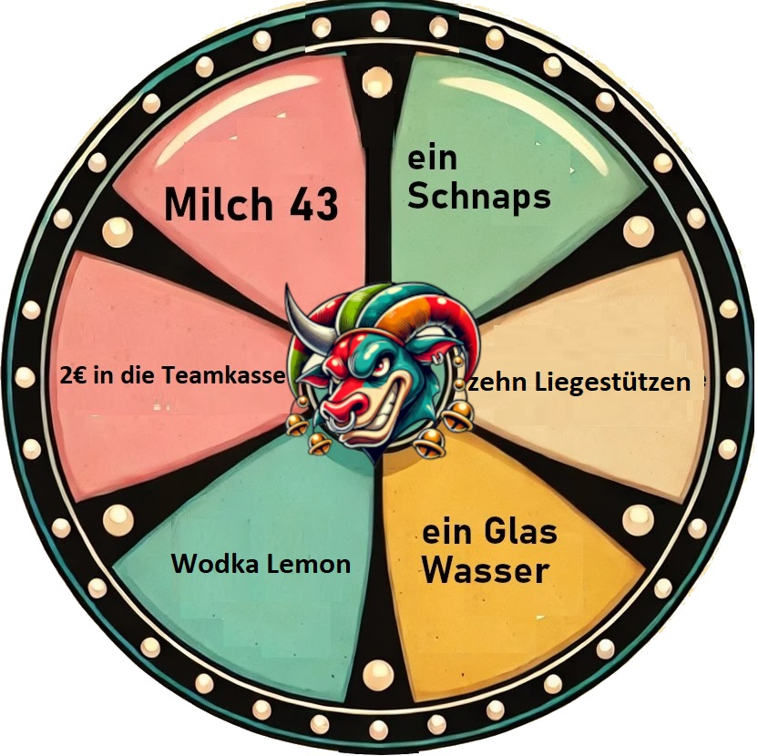

<!DOCTYPE html>
<html lang="de">
<head>
    <meta charset="UTF-8">
    <meta name="viewport" content="width=device-width, initial-scale=1.0">
    <title>Partyspiel für 2 Spieler</title>
    
</head>
<body>

    

    

        
        

            

        

        
         <!-- Glücksrad-Bild -->
        
        <button class="btn" id="gluecksradBtn" onclick="startGame()">Spin the Wheel</button>
        
        

            

                

            

            

                

            

        

        <button class="btn" id="wuerfel1Btn" onclick="wuerfeln1()" disabled>Roll</button>
        
        

            

                

            

            

                

            

        

        <button class="btn" id="wuerfel2Btn" onclick="wuerfeln2()" disabled>Roll</button>
        
        
Wer gewinnt?

        
        

    

    
</body>
</html>
